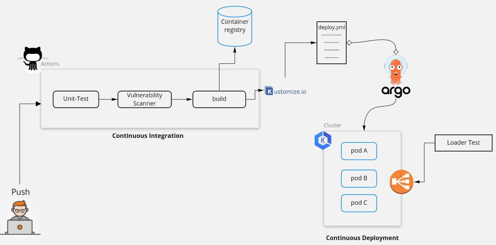
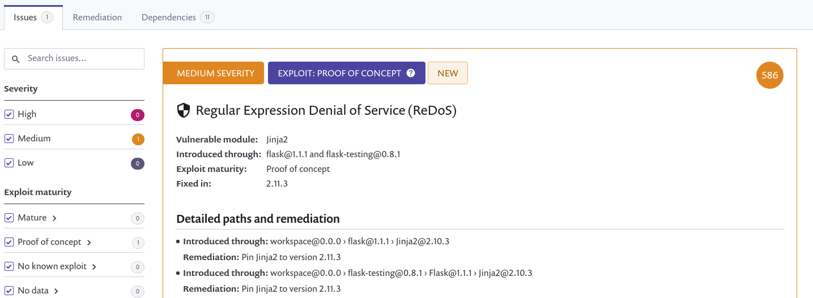
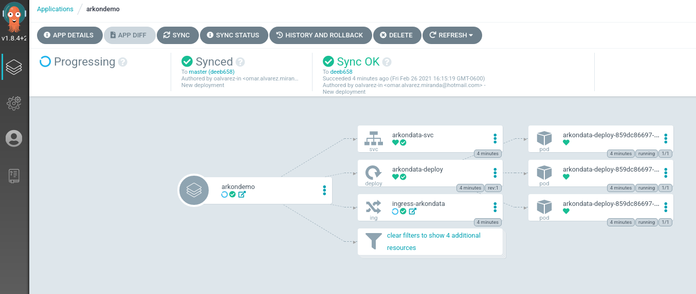

# Abraxas DevOps Exercise

## **Intro**

---

As a DevOps we need you to create a mechanism to deploy nanoservices. You'll be in charge of deploy, monitor, scale applications and promote the DevOps culture with the development team. But let's start by the begining, below you'll find the requirements for this test.

### Architecture

---



### Stack

---

- | [Snyk](https://snyk.io/) | [Kustomize](https://kustomize.io/) |
  [Github Actions](https://github.com/features/actions) | [ArgoCD](https://argo-cd.readthedocs.io/en/stable/) |
  [DockerHub](https://hub.docker.com/) | [EKS](https://aws.amazon.com/eks/?whats-new-cards.sort-by=item.additionalFields.postDateTime&whats-new-cards.sort-order=desc&eks-blogs.sort-by=item.additionalFields.createdDate&eks-blogs.sort-order=desc)

## Process

---

This DevOps exercise contains the essential elements of the CI/CD process for containerized services deployed on Kubernetes. The process consists of the following steps

1. Developer makes the necessary changes to the code and executes a push to the central repository, in this case, it will be using Github.

2. [Github Actions](.github/workflows/ci.yaml) detects a push event and executes the defined workflow:

- Unit test execution

```python
  python -m unittest tests/test_base.py
```

- Execution of vulnerability testing using snyk

```sh
snyk monitor --file=requirements.txt --command=python3 --package-manager=pip --skip-unresolved=true
```



- Create and upload image to [DockerHub](https://hub.docker.com/r/oalva/arkondata-app)
- Configuring [YAML files](kustomize/base) using Kustomize

```sh
kustomize edit set image arkondata-gitops=oalva/arkondata-app:${{ env.CONTAINER_VERSION }}
```

3. ArgoCD detects an update in the kustomization.yaml file and deploys it to the kubernetes cluster.



To test the service:

- **GET** request: Give actual number.
- **POST** request: Sum 1 unit to actual number

## Deliverables

- A link to the public docker registry where the image is published.
  [Registry](https://hub.docker.com/r/oalva/arkondata-app)

- A link to your repository containing:

  1. The [Dockerfile](./Dockefile) for the image.
  2. The kubernetes [files](kustomize/base) for the service deployment(s). The deployment should be replicable on our kubernetes cluster.
  3. Optionally the code for the improved version of the service.
